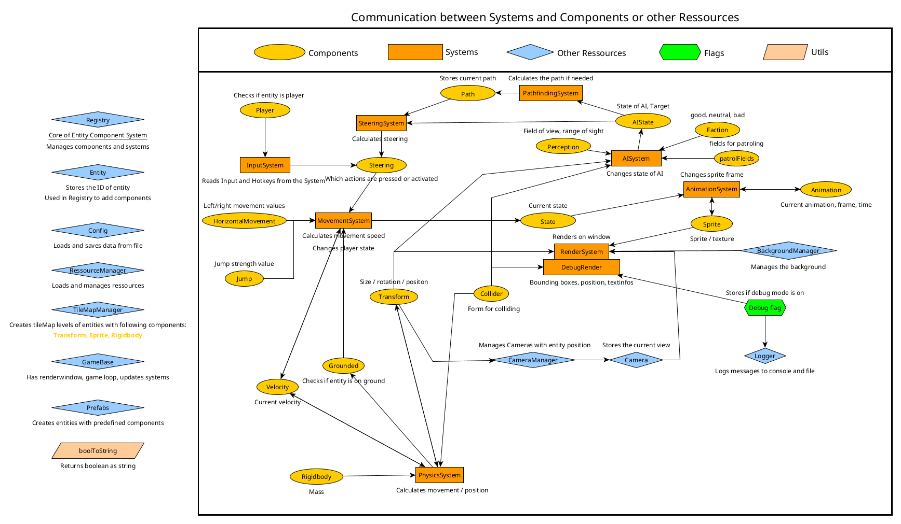

# TenshiEngine
### Game Engine for 2D Games with EntityComponentSystem (ECS)
### Written in C++/SFML

---

## Main Features
- **Entity Component System** - Dynamically add or modify components to entities at runtime
- **Systems** - Process and update Entities by reading/writing their components
- **SFML Rendering** - 2D Rendering with Sprites/Textures
- **Managers** - Handling various kinds of tasks
- **GameBase** - A ready-to-use game loop and render window setup
- **Prefabs** - Ready-to-use entities with components
- **Config** - Config file for loading and saving data

---

- [Info](#Info)
- [Documentation](#Documentation)
- [Installation](#Installation)
  - [Requirements](#Requirements)
  - [Linux](#Linux)
- [Usage](#Usage)
  - [Quick Start](#Quick-Start)
    - [main.cpp](#maincpp)
    - [Game.cpp](#Gamecpp)
    - [Managing components](#Managing-components)
  - [Important Modules](#Important-Modules)
  - [Config](#Config)
	  - [Config.ini](#Configini)
  - [Json files](#Json-files)
    - [Tileset.json](#Tilesetjson)
    - [Level.json](#Leveljson )
    - [Animation.json](#Animationjson)
  - [Log file](#Log-file)
- [Contributing](#Contributing)
- [Changelog](#Changelog)
- [License](#License)

---

## Info
The Engine is a library with different classes and methods that can be used to build 2D games.

It uses an Entity Component System, which means that entities and components will be added and managed through the registry.

Different systems are responsible for managing the logic, like physics or rendering, and are automatically using components that are needed.

Managers take on other tasks like managing resources or loading levels, and are also automatically updated.

**Below is a graph that shows how the different systems, components and managers communicate with each other**



---

## Documentation
You can find the latest API documentation here: [TenshiEngine API Docs](https://Queltenshi.github.io/TenshiEngine/)

---

## Installation
### Requirements 
- C++ 17+
- [SFML](https://www.sfml-dev.org/) 3.0+
- [CMake](https://cmake.org/) 3.16+

### Linux 
```bash
git clone https://github.com/Queltenshi/TenshiEngine.git
cd TenshiEngine
mkdir build
cd build
cmake .. -DCMAKE_BUILD_TYPE=Release
cmake --build . --config Release
sudo cmake --install . --prefix /usr/local

```

---

## Usage

### Quick Start
#### main.cpp 
``` cpp
#include <Game.h>

int main(){
    //Creating and running the game
    Game game;
    game.init();
    game.run();
    return 0;
}
```

#### Game.cpp 

This will create a simple level with tilemap, moveable platformer character, camera and background

``` cpp
#include <TenshiEngine/Game/GameBase.hpp>
#include <TenshiEngine/Game/Prefabs.hpp>

class Game : public te::GameBase {
public:
    Game();
    
    void init(){
        //Calling the Parent to init the Engine
        GameBase::init();

        //Loading tileset with texture and json file
        auto tileSetTexture = mResourceManager.addTexture("Tileset", "Path/to/texture");
        auto tileSetData = mResourceManager.addJson("Tileset", "Path/to/json");
        mTileMapManager.loadTileset(tileSetTexture, tileSetData);

        //Loading level with json file
        auto level1Data = mResourceManager.addJson("Level1", "Path/to/json");
        mTileMapManager.loadLevel(level1);

        //Creating player with texture and json file
        auto playerTexture = mResourceManager.addTexture("Player","Path/to/texture");
        auto playerAnimationData = mResourceManager.addJson("Player", "Path/to/json");
        mPlayer = te::Prefabs::PlatformerPlayer(mRegistry, playerTexture, playerTextureData);

        //Creating camera which will be attached to the player and move in all direction
        //Creating is optional, default is camera with horizontal movement
        mCameraManager.addCamera(mPlayer.id, te::Camera::Movement::FREE);

        ///Creating a background with half the movement speed of the camera
        ///second parameter is optional, default is 0, which means static background
        auto backgroundTexture = mResourceManager.addTexture("Background", "Path/to/texture");
        mBackgroundManager.setBackground(backgroundTexture, 0.5f);

}

private:
    //Entity with ID
    te::Entity mPlayer;
};
```

#### Managing components 

To add or change components from entities u can do this by using the registry

Example:

``` cpp
    //Adding component to entity
    mRegistry.addComponent(entity.id, te::components::Transform());

    //Getting the component and changing its member
    auto transform = mRegistry.getComponent<te::components::Transform>(entity.id);
    transform->scale = {0.75f, 0.75f};

    //Adding components also returns the added component
    auto jump = mRegistry.addComponent(entity.id, te::components::Jump());
    jump->strength = 500.f;
```

### Important Modules
- **GameBase** To use the engine and create a game, you have to inherit from the GameBase class and call the parent Init();
- **Registry** - Managing entities and components
- **Entity** - Stores only the ID of an entity that is used by the registry
- **Components** - Are added through the registry to store data, which then can be used by the systems. Can also be get by the registry to change the data
- **RessourceManager** - Manages resources like texture or json files
- **TileMapManager** - Manages tilesets and creates tilemap levels
- **CameraManager** - Manages cameras that are attached to entities with current view
- **BackgroundManager** - Manages the background and its movement
- **Logger** - Logs messages with different log levels and is automatically used by other modules
- **Prefabs** - Create ready-to-use entities with pre-defined components like PlatformerPlayer

### Config file

the config file gets automatically loaded when the game is started, if there is no file, one will be created

Missing or corrupt data is set with default values

Input can be set with the following keys: A-Z, NUM0-NUM9, Space, LShift, LControl, MouseLeft, MouseRight

Below is the config file with default values

#### Config.ini
```ini
[Video]
ResolutionWidth = 1920
ResolutionHeight = 1080
FPS = 60
Fullscreen = false


[Input]
Sprint = LShift
Crouch = LControl
Attack = MouseLeft
MoveLeft = A
MoveRight = D
Jump = Space


[System]
GameName = Game
GravityForce = 25.000000
DebugMode = false
```

### Json files

[Tiled](https://www.mapeditor.org/) can be used to create json and texture files for tilesets

[Free Texture Packer](https://free-tex-packer.com/) can be used to create json and texture files for animation

Below are example files with important data to show how they should look like in order to be properly loaded

#### Tileset.json 
``` json
{"tileheight":64,
 "tiles":[
        {
         "id":1,
         "properties":[
                {
                 "name":"collider",
                 "type":"bool",
                 "value":true
                }]
        }, 
        {
         "id":2,
         "properties":[
                {
                 "name":"collider",
                 "type":"bool",
                 "value":true
                }]
        }, 
        {
         "id":5,
         "properties":[
                {
                 "name":"collider",
                 "type":"bool",
                 "value":true
                }]
        }],
 "tilewidth":64
}
```

#### Level.json 
``` json
{"height":17,
 "layers":[
        {
         "data":[0, 0, 0, 0, 0, 0, 0, 0, 0, 0, 0, 0, 0, 0, 0, 0, 0, 0, 0, 0, 0, 0, 0, 0, 0, 0, 0, 0, 0, 0,
            0, 0, 0, 0, 0, 0, 0, 0, 0, 0, 0, 0, 0, 0, 0, 0, 0, 0, 0, 0, 0, 0, 0, 0, 0, 0, 0, 0, 0, 0,
            0, 0, 0, 0, 0, 0, 0, 0, 0, 0, 0, 0, 0, 0, 0, 0, 0, 0, 0, 0, 0, 0, 0, 0, 0, 0, 0, 0, 0, 0,
            0, 0, 0, 0, 0, 0, 0, 0, 0, 0, 0, 0, 0, 0, 0, 0, 0, 0, 0, 0, 0, 0, 0, 0, 0, 0, 0, 0, 0, 0,
            0, 0, 0, 0, 0, 0, 0, 0, 0, 0, 0, 0, 0, 0, 0, 0, 0, 0, 0, 0, 0, 0, 0, 0, 0, 4, 4, 4, 0, 0,
            0, 0, 0, 0, 0, 0, 0, 0, 0, 0, 0, 0, 0, 0, 0, 0, 0, 0, 0, 0, 0, 0, 4, 4, 4, 0, 0, 0, 0, 0,
            0, 0, 0, 0, 0, 0, 0, 0, 0, 0, 0, 0, 0, 0, 0, 0, 0, 0, 0, 0, 0, 0, 0, 0, 0, 0, 0, 0, 0, 0,
            0, 0, 0, 0, 0, 0, 0, 0, 0, 0, 0, 0, 0, 0, 5, 4, 4, 4, 6, 0, 0, 0, 0, 0, 0, 0, 0, 0, 0, 0,
            0, 0, 0, 0, 0, 0, 0, 0, 0, 0, 0, 0, 0, 0, 2, 1, 1, 1, 3, 0, 0, 0, 0, 0, 0, 0, 0, 0, 0, 0,
            0, 0, 0, 0, 0, 0, 0, 0, 0, 0, 5, 4, 4, 4, 1, 1, 1, 1, 3, 0, 0, 0, 0, 0, 0, 0, 0, 0, 0, 0,
            0, 0, 0, 0, 0, 0, 0, 0, 0, 0, 2, 1, 1, 1, 1, 1, 1, 1, 3, 0, 0, 0, 0, 0, 0, 0, 0, 0, 0, 0,
            0, 0, 0, 0, 0, 0, 5, 4, 4, 4, 1, 1, 1, 1, 1, 1, 1, 1, 3, 0, 0, 0, 0, 0, 0, 0, 0, 0, 0, 0,
            4, 4, 4, 4, 4, 4, 1, 1, 1, 1, 1, 1, 1, 1, 1, 1, 1, 1, 3, 0, 0, 0, 0, 0, 0, 0, 0, 0, 0, 0,
            1, 1, 1, 1, 1, 1, 1, 1, 1, 1, 1, 1, 1, 1, 1, 1, 1, 1, 1, 4, 4, 4, 4, 4, 4, 4, 4, 4, 4, 4,
            1, 1, 1, 1, 1, 1, 1, 1, 1, 1, 1, 1, 1, 1, 1, 1, 1, 1, 1, 1, 1, 1, 1, 1, 1, 1, 1, 1, 1, 1,
            1, 1, 1, 1, 1, 1, 1, 1, 1, 1, 1, 1, 1, 1, 1, 1, 1, 1, 1, 1, 1, 1, 1, 1, 1, 1, 1, 1, 1, 1,
            1, 1, 1, 1, 1, 1, 1, 1, 1, 1, 1, 1, 1, 1, 1, 1, 1, 1, 1, 1, 1, 1, 1, 1, 1, 1, 1, 1, 1, 1]
        }],
 "width":30
}
```

#### Animation.json 
``` json
{"animations": {
    "hit": [
      {"x":0,"y":0,"w":222,"h":500}
    ],
    "idle": [
      {"x":0,"y":1000,"w":130,"h":500}
    ],
    "jump": [
      {"x":0,"y":500,"w":139,"h":500}
    ],
    "fall": [
      {"x":0,"y":500,"w":139,"h":500}
    ],
    "walk": [
      {"x":0,"y":1000,"w":130,"h":500},
      {"x":0,"y":1500,"w":174,"h":477}
    ]
  }
}
```

### Log file

A new log file is automatically created when starting the game

Console messages will be written in this file on runtime

---

More Information to usage can be found at [TenshiEngine API Docs](https://Queltenshi.github.io/TenshiEngine/)

---

## Contributing
This project is currently maintained solely by the author.  
External contributions, pull requests, or forks are welcome for personal use or experimentation,  
but they will **not be merged** into the main repository at this time.

---

## Changelog
See the full changelog [here](CHANGELOG.md).

---

## License
This project is licensed under the GNU GPL v3 

It uses:
- [SFML](https://www.sfml-dev.org/) - licensed under the zlib/libpng license
- [nlohmann/json](https://github.com/nlohmann/json) – licensed under the MIT license
- [brofield/simpleini](https://github.com/brofield/simpleini) - licensed under the MIT license
